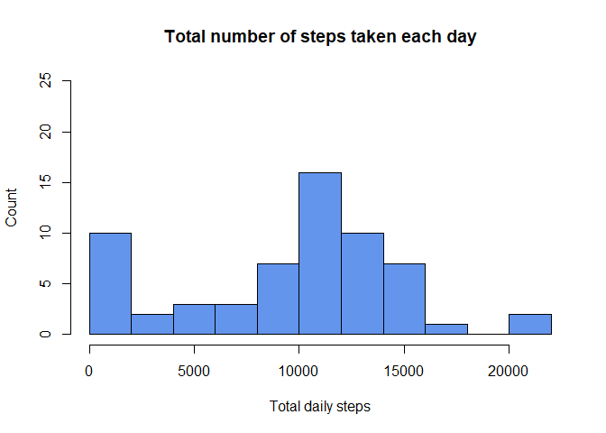

## Loading and preprocessing the data


This section describes the process to unzip dataset file and read it into a dataframe called "**`activity`**." The first three lines of code which have been commented out shows the steps to download the dataset if unavailable in the project folder. 


```r
# file.URL <- "https://d396qusza40orc.cloudfront.net/repdata%2Fdata%2Factivity.zip"
# file.dir <- "./activity.zip"
# download.file(file.URL, file.dir, method = "auto")


file.name <- "activity.csv"
file.dir <- "./activity.zip"
unzip(file.dir)
activity <- read.csv(file.name, na.strings = "NA")
file.remove(file.name)
rm(file.dir, file.name)
```


Next, we will check the data and perform any pre-processing as required.

```r
# check dataframe
str(activity)
```

```
## 'data.frame':	17568 obs. of  3 variables:
##  $ steps   : int  NA NA NA NA NA NA NA NA NA NA ...
##  $ date    : chr  "2012-10-01" "2012-10-01" "2012-10-01" "2012-10-01" ...
##  $ interval: int  0 5 10 15 20 25 30 35 40 45 ...
```

```r
# check for missing values
colSums(is.na(activity))
```

```
##    steps     date interval 
##     2304        0        0
```

```r
# convert date from character to date format
activity$date <- as.Date(activity$date, format = "%Y-%m-%d")
head(activity)
```

```
##   steps       date interval
## 1    NA 2012-10-01        0
## 2    NA 2012-10-01        5
## 3    NA 2012-10-01       10
## 4    NA 2012-10-01       15
## 5    NA 2012-10-01       20
## 6    NA 2012-10-01       25
```

```r
str(activity)
```

```
## 'data.frame':	17568 obs. of  3 variables:
##  $ steps   : int  NA NA NA NA NA NA NA NA NA NA ...
##  $ date    : Date, format: "2012-10-01" "2012-10-01" ...
##  $ interval: int  0 5 10 15 20 25 30 35 40 45 ...
```


## What is mean total number of steps taken per day?
To find this, we will first create a vector for total daily steps by summing steps for a given date using the tapply function. As there are missing values, we will just ignore them for this question. Using this vector, we will calculate the daily mean, median and plot a histogram of total daily steps.

```r
# Total number of steps taken per day, mean and median
total.daily.steps <-
        with(activity, tapply(steps, date, sum, na.rm = TRUE))
mean.daily.steps <- mean(total.daily.steps)
median.daily.steps <- median(total.daily.steps)


# histogram of the total number of steps taken each day
hist(
        x = total.daily.steps,
        breaks = 8,
        col = "cornflowerblue",
        main = "Total number of steps taken each day",
        xlab = "Total daily steps",
        ylab = "Count",
        ylim = c(0, 25)
)
```

<!-- -->


The average number of steps taken in a day is 9,354 and the median is 10,395.


## What is the average daily activity pattern?
For this question, we will first create a data frame by grouping observations in the same interval over the 61 days. 

```r
# Make a time series plot (i.e. type = "l") of the 5-minute interval (x-axis)
# and the average number of steps taken, averaged across all days (y-axis)

daily.steps <- activity %>%
        group_by(interval) %>%
        summarise("Average.Daily.Steps" = mean(steps, na.rm = TRUE))

interval.breaks <- c(0, 392.5, 785, 1177.5, 1570, 1962.5, 2355)
interval.labels <- c("00:00", "04:00", "08:00",
                     "12:00", "16:00", "20:00", "24:00")
with(
        daily.steps,
        plot(
                x = interval,
                y = Average.Daily.Steps,
                type = "l",
                main = "Average daily steps in the 5-min interval",
                xlab = "5-minute interval over 24 hours",
                ylab = "Average steps over 61 days",
                xaxt = "n"
        )
)
axis(1, at = interval.breaks, labels = interval.labels)
```

<!-- -->


The next part of this questions is to find the 5-min interval which contains the maximum number of steps. To find that, we will use the `which.max()` function on the above data frame.


```r
# Which 5-minute interval, on average across all the days in the dataset,
# contains the maximum number of steps?
max.step.index <- which.max(daily.steps$Average.Daily.Steps)
time_start <- sprintf("%02d:%02d", ((max.step.index * 5) %/% 60),
                      ((max.step.index * 5) %% 60))
time_end <- sprintf("%02d:%02d", ((max.step.index * 5 + 5) %/% 60),
                    ((max.step.index * 5 + 5) %% 60))
max.steps <- daily.steps$Average.Daily.Steps[max.step.index]
# cat(paste0("From ", time_start, " - ", time_end, "AM with ",
#         format(max.steps, digits = 3), " steps."))
```
The maximum number of steps taken during the day over the 61 days is from 08:40 to 08:45 (AM).


## Imputing missing values

```r
# Calculate and report the total number of missing values in the dataset (i.e. the total number of rows with NAs)
missing.obs <- length(activity[rowSums(is.na(activity)) > 0, 1])
colSums(is.na(activity))
```

```
##    steps     date interval 
##     2304        0        0
```

```r
round(missing.obs / nrow(activity) * 100, 2)
```

```
## [1] 13.11
```

```r
# Devise a strategy for filling in all of the missing values in the dataset. The strategy does not need to be sophisticated. For example, you could use the mean/median for that day, or the mean for that 5-minute interval, etc.

# Create a new dataset that is equal to the original dataset but with the missing data filled in.

missing.index <- which(rowSums(is.na(activity)) > 0)
length(missing.index)
```

```
## [1] 2304
```

```r
# checking if steps is missing for all intervals or entire day
activity$interval[missing.index]
```

```
##    [1]    0    5   10   15   20   25   30   35   40   45   50   55  100  105
##   [15]  110  115  120  125  130  135  140  145  150  155  200  205  210  215
##   [29]  220  225  230  235  240  245  250  255  300  305  310  315  320  325
##   [43]  330  335  340  345  350  355  400  405  410  415  420  425  430  435
##   [57]  440  445  450  455  500  505  510  515  520  525  530  535  540  545
##   [71]  550  555  600  605  610  615  620  625  630  635  640  645  650  655
##   [85]  700  705  710  715  720  725  730  735  740  745  750  755  800  805
##   [99]  810  815  820  825  830  835  840  845  850  855  900  905  910  915
##  [113]  920  925  930  935  940  945  950  955 1000 1005 1010 1015 1020 1025
##  [127] 1030 1035 1040 1045 1050 1055 1100 1105 1110 1115 1120 1125 1130 1135
##  [141] 1140 1145 1150 1155 1200 1205 1210 1215 1220 1225 1230 1235 1240 1245
##  [155] 1250 1255 1300 1305 1310 1315 1320 1325 1330 1335 1340 1345 1350 1355
##  [169] 1400 1405 1410 1415 1420 1425 1430 1435 1440 1445 1450 1455 1500 1505
##  [183] 1510 1515 1520 1525 1530 1535 1540 1545 1550 1555 1600 1605 1610 1615
##  [197] 1620 1625 1630 1635 1640 1645 1650 1655 1700 1705 1710 1715 1720 1725
##  [211] 1730 1735 1740 1745 1750 1755 1800 1805 1810 1815 1820 1825 1830 1835
##  [225] 1840 1845 1850 1855 1900 1905 1910 1915 1920 1925 1930 1935 1940 1945
##  [239] 1950 1955 2000 2005 2010 2015 2020 2025 2030 2035 2040 2045 2050 2055
##  [253] 2100 2105 2110 2115 2120 2125 2130 2135 2140 2145 2150 2155 2200 2205
##  [267] 2210 2215 2220 2225 2230 2235 2240 2245 2250 2255 2300 2305 2310 2315
##  [281] 2320 2325 2330 2335 2340 2345 2350 2355    0    5   10   15   20   25
##  [295]   30   35   40   45   50   55  100  105  110  115  120  125  130  135
##  [309]  140  145  150  155  200  205  210  215  220  225  230  235  240  245
##  [323]  250  255  300  305  310  315  320  325  330  335  340  345  350  355
##  [337]  400  405  410  415  420  425  430  435  440  445  450  455  500  505
##  [351]  510  515  520  525  530  535  540  545  550  555  600  605  610  615
##  [365]  620  625  630  635  640  645  650  655  700  705  710  715  720  725
##  [379]  730  735  740  745  750  755  800  805  810  815  820  825  830  835
##  [393]  840  845  850  855  900  905  910  915  920  925  930  935  940  945
##  [407]  950  955 1000 1005 1010 1015 1020 1025 1030 1035 1040 1045 1050 1055
##  [421] 1100 1105 1110 1115 1120 1125 1130 1135 1140 1145 1150 1155 1200 1205
##  [435] 1210 1215 1220 1225 1230 1235 1240 1245 1250 1255 1300 1305 1310 1315
##  [449] 1320 1325 1330 1335 1340 1345 1350 1355 1400 1405 1410 1415 1420 1425
##  [463] 1430 1435 1440 1445 1450 1455 1500 1505 1510 1515 1520 1525 1530 1535
##  [477] 1540 1545 1550 1555 1600 1605 1610 1615 1620 1625 1630 1635 1640 1645
##  [491] 1650 1655 1700 1705 1710 1715 1720 1725 1730 1735 1740 1745 1750 1755
##  [505] 1800 1805 1810 1815 1820 1825 1830 1835 1840 1845 1850 1855 1900 1905
##  [519] 1910 1915 1920 1925 1930 1935 1940 1945 1950 1955 2000 2005 2010 2015
##  [533] 2020 2025 2030 2035 2040 2045 2050 2055 2100 2105 2110 2115 2120 2125
##  [547] 2130 2135 2140 2145 2150 2155 2200 2205 2210 2215 2220 2225 2230 2235
##  [561] 2240 2245 2250 2255 2300 2305 2310 2315 2320 2325 2330 2335 2340 2345
##  [575] 2350 2355    0    5   10   15   20   25   30   35   40   45   50   55
##  [589]  100  105  110  115  120  125  130  135  140  145  150  155  200  205
##  [603]  210  215  220  225  230  235  240  245  250  255  300  305  310  315
##  [617]  320  325  330  335  340  345  350  355  400  405  410  415  420  425
##  [631]  430  435  440  445  450  455  500  505  510  515  520  525  530  535
##  [645]  540  545  550  555  600  605  610  615  620  625  630  635  640  645
##  [659]  650  655  700  705  710  715  720  725  730  735  740  745  750  755
##  [673]  800  805  810  815  820  825  830  835  840  845  850  855  900  905
##  [687]  910  915  920  925  930  935  940  945  950  955 1000 1005 1010 1015
##  [701] 1020 1025 1030 1035 1040 1045 1050 1055 1100 1105 1110 1115 1120 1125
##  [715] 1130 1135 1140 1145 1150 1155 1200 1205 1210 1215 1220 1225 1230 1235
##  [729] 1240 1245 1250 1255 1300 1305 1310 1315 1320 1325 1330 1335 1340 1345
##  [743] 1350 1355 1400 1405 1410 1415 1420 1425 1430 1435 1440 1445 1450 1455
##  [757] 1500 1505 1510 1515 1520 1525 1530 1535 1540 1545 1550 1555 1600 1605
##  [771] 1610 1615 1620 1625 1630 1635 1640 1645 1650 1655 1700 1705 1710 1715
##  [785] 1720 1725 1730 1735 1740 1745 1750 1755 1800 1805 1810 1815 1820 1825
##  [799] 1830 1835 1840 1845 1850 1855 1900 1905 1910 1915 1920 1925 1930 1935
##  [813] 1940 1945 1950 1955 2000 2005 2010 2015 2020 2025 2030 2035 2040 2045
##  [827] 2050 2055 2100 2105 2110 2115 2120 2125 2130 2135 2140 2145 2150 2155
##  [841] 2200 2205 2210 2215 2220 2225 2230 2235 2240 2245 2250 2255 2300 2305
##  [855] 2310 2315 2320 2325 2330 2335 2340 2345 2350 2355    0    5   10   15
##  [869]   20   25   30   35   40   45   50   55  100  105  110  115  120  125
##  [883]  130  135  140  145  150  155  200  205  210  215  220  225  230  235
##  [897]  240  245  250  255  300  305  310  315  320  325  330  335  340  345
##  [911]  350  355  400  405  410  415  420  425  430  435  440  445  450  455
##  [925]  500  505  510  515  520  525  530  535  540  545  550  555  600  605
##  [939]  610  615  620  625  630  635  640  645  650  655  700  705  710  715
##  [953]  720  725  730  735  740  745  750  755  800  805  810  815  820  825
##  [967]  830  835  840  845  850  855  900  905  910  915  920  925  930  935
##  [981]  940  945  950  955 1000 1005 1010 1015 1020 1025 1030 1035 1040 1045
##  [995] 1050 1055 1100 1105 1110 1115 1120 1125 1130 1135 1140 1145 1150 1155
## [1009] 1200 1205 1210 1215 1220 1225 1230 1235 1240 1245 1250 1255 1300 1305
## [1023] 1310 1315 1320 1325 1330 1335 1340 1345 1350 1355 1400 1405 1410 1415
## [1037] 1420 1425 1430 1435 1440 1445 1450 1455 1500 1505 1510 1515 1520 1525
## [1051] 1530 1535 1540 1545 1550 1555 1600 1605 1610 1615 1620 1625 1630 1635
## [1065] 1640 1645 1650 1655 1700 1705 1710 1715 1720 1725 1730 1735 1740 1745
## [1079] 1750 1755 1800 1805 1810 1815 1820 1825 1830 1835 1840 1845 1850 1855
## [1093] 1900 1905 1910 1915 1920 1925 1930 1935 1940 1945 1950 1955 2000 2005
## [1107] 2010 2015 2020 2025 2030 2035 2040 2045 2050 2055 2100 2105 2110 2115
## [1121] 2120 2125 2130 2135 2140 2145 2150 2155 2200 2205 2210 2215 2220 2225
## [1135] 2230 2235 2240 2245 2250 2255 2300 2305 2310 2315 2320 2325 2330 2335
## [1149] 2340 2345 2350 2355    0    5   10   15   20   25   30   35   40   45
## [1163]   50   55  100  105  110  115  120  125  130  135  140  145  150  155
## [1177]  200  205  210  215  220  225  230  235  240  245  250  255  300  305
## [1191]  310  315  320  325  330  335  340  345  350  355  400  405  410  415
## [1205]  420  425  430  435  440  445  450  455  500  505  510  515  520  525
## [1219]  530  535  540  545  550  555  600  605  610  615  620  625  630  635
## [1233]  640  645  650  655  700  705  710  715  720  725  730  735  740  745
## [1247]  750  755  800  805  810  815  820  825  830  835  840  845  850  855
## [1261]  900  905  910  915  920  925  930  935  940  945  950  955 1000 1005
## [1275] 1010 1015 1020 1025 1030 1035 1040 1045 1050 1055 1100 1105 1110 1115
## [1289] 1120 1125 1130 1135 1140 1145 1150 1155 1200 1205 1210 1215 1220 1225
## [1303] 1230 1235 1240 1245 1250 1255 1300 1305 1310 1315 1320 1325 1330 1335
## [1317] 1340 1345 1350 1355 1400 1405 1410 1415 1420 1425 1430 1435 1440 1445
## [1331] 1450 1455 1500 1505 1510 1515 1520 1525 1530 1535 1540 1545 1550 1555
## [1345] 1600 1605 1610 1615 1620 1625 1630 1635 1640 1645 1650 1655 1700 1705
## [1359] 1710 1715 1720 1725 1730 1735 1740 1745 1750 1755 1800 1805 1810 1815
## [1373] 1820 1825 1830 1835 1840 1845 1850 1855 1900 1905 1910 1915 1920 1925
## [1387] 1930 1935 1940 1945 1950 1955 2000 2005 2010 2015 2020 2025 2030 2035
## [1401] 2040 2045 2050 2055 2100 2105 2110 2115 2120 2125 2130 2135 2140 2145
## [1415] 2150 2155 2200 2205 2210 2215 2220 2225 2230 2235 2240 2245 2250 2255
## [1429] 2300 2305 2310 2315 2320 2325 2330 2335 2340 2345 2350 2355    0    5
## [1443]   10   15   20   25   30   35   40   45   50   55  100  105  110  115
## [1457]  120  125  130  135  140  145  150  155  200  205  210  215  220  225
## [1471]  230  235  240  245  250  255  300  305  310  315  320  325  330  335
## [1485]  340  345  350  355  400  405  410  415  420  425  430  435  440  445
## [1499]  450  455  500  505  510  515  520  525  530  535  540  545  550  555
## [1513]  600  605  610  615  620  625  630  635  640  645  650  655  700  705
## [1527]  710  715  720  725  730  735  740  745  750  755  800  805  810  815
## [1541]  820  825  830  835  840  845  850  855  900  905  910  915  920  925
## [1555]  930  935  940  945  950  955 1000 1005 1010 1015 1020 1025 1030 1035
## [1569] 1040 1045 1050 1055 1100 1105 1110 1115 1120 1125 1130 1135 1140 1145
## [1583] 1150 1155 1200 1205 1210 1215 1220 1225 1230 1235 1240 1245 1250 1255
## [1597] 1300 1305 1310 1315 1320 1325 1330 1335 1340 1345 1350 1355 1400 1405
## [1611] 1410 1415 1420 1425 1430 1435 1440 1445 1450 1455 1500 1505 1510 1515
## [1625] 1520 1525 1530 1535 1540 1545 1550 1555 1600 1605 1610 1615 1620 1625
## [1639] 1630 1635 1640 1645 1650 1655 1700 1705 1710 1715 1720 1725 1730 1735
## [1653] 1740 1745 1750 1755 1800 1805 1810 1815 1820 1825 1830 1835 1840 1845
## [1667] 1850 1855 1900 1905 1910 1915 1920 1925 1930 1935 1940 1945 1950 1955
## [1681] 2000 2005 2010 2015 2020 2025 2030 2035 2040 2045 2050 2055 2100 2105
## [1695] 2110 2115 2120 2125 2130 2135 2140 2145 2150 2155 2200 2205 2210 2215
## [1709] 2220 2225 2230 2235 2240 2245 2250 2255 2300 2305 2310 2315 2320 2325
## [1723] 2330 2335 2340 2345 2350 2355    0    5   10   15   20   25   30   35
## [1737]   40   45   50   55  100  105  110  115  120  125  130  135  140  145
## [1751]  150  155  200  205  210  215  220  225  230  235  240  245  250  255
## [1765]  300  305  310  315  320  325  330  335  340  345  350  355  400  405
## [1779]  410  415  420  425  430  435  440  445  450  455  500  505  510  515
## [1793]  520  525  530  535  540  545  550  555  600  605  610  615  620  625
## [1807]  630  635  640  645  650  655  700  705  710  715  720  725  730  735
## [1821]  740  745  750  755  800  805  810  815  820  825  830  835  840  845
## [1835]  850  855  900  905  910  915  920  925  930  935  940  945  950  955
## [1849] 1000 1005 1010 1015 1020 1025 1030 1035 1040 1045 1050 1055 1100 1105
## [1863] 1110 1115 1120 1125 1130 1135 1140 1145 1150 1155 1200 1205 1210 1215
## [1877] 1220 1225 1230 1235 1240 1245 1250 1255 1300 1305 1310 1315 1320 1325
## [1891] 1330 1335 1340 1345 1350 1355 1400 1405 1410 1415 1420 1425 1430 1435
## [1905] 1440 1445 1450 1455 1500 1505 1510 1515 1520 1525 1530 1535 1540 1545
## [1919] 1550 1555 1600 1605 1610 1615 1620 1625 1630 1635 1640 1645 1650 1655
## [1933] 1700 1705 1710 1715 1720 1725 1730 1735 1740 1745 1750 1755 1800 1805
## [1947] 1810 1815 1820 1825 1830 1835 1840 1845 1850 1855 1900 1905 1910 1915
## [1961] 1920 1925 1930 1935 1940 1945 1950 1955 2000 2005 2010 2015 2020 2025
## [1975] 2030 2035 2040 2045 2050 2055 2100 2105 2110 2115 2120 2125 2130 2135
## [1989] 2140 2145 2150 2155 2200 2205 2210 2215 2220 2225 2230 2235 2240 2245
## [2003] 2250 2255 2300 2305 2310 2315 2320 2325 2330 2335 2340 2345 2350 2355
## [2017]    0    5   10   15   20   25   30   35   40   45   50   55  100  105
## [2031]  110  115  120  125  130  135  140  145  150  155  200  205  210  215
## [2045]  220  225  230  235  240  245  250  255  300  305  310  315  320  325
## [2059]  330  335  340  345  350  355  400  405  410  415  420  425  430  435
## [2073]  440  445  450  455  500  505  510  515  520  525  530  535  540  545
## [2087]  550  555  600  605  610  615  620  625  630  635  640  645  650  655
## [2101]  700  705  710  715  720  725  730  735  740  745  750  755  800  805
## [2115]  810  815  820  825  830  835  840  845  850  855  900  905  910  915
## [2129]  920  925  930  935  940  945  950  955 1000 1005 1010 1015 1020 1025
## [2143] 1030 1035 1040 1045 1050 1055 1100 1105 1110 1115 1120 1125 1130 1135
## [2157] 1140 1145 1150 1155 1200 1205 1210 1215 1220 1225 1230 1235 1240 1245
## [2171] 1250 1255 1300 1305 1310 1315 1320 1325 1330 1335 1340 1345 1350 1355
## [2185] 1400 1405 1410 1415 1420 1425 1430 1435 1440 1445 1450 1455 1500 1505
## [2199] 1510 1515 1520 1525 1530 1535 1540 1545 1550 1555 1600 1605 1610 1615
## [2213] 1620 1625 1630 1635 1640 1645 1650 1655 1700 1705 1710 1715 1720 1725
## [2227] 1730 1735 1740 1745 1750 1755 1800 1805 1810 1815 1820 1825 1830 1835
## [2241] 1840 1845 1850 1855 1900 1905 1910 1915 1920 1925 1930 1935 1940 1945
## [2255] 1950 1955 2000 2005 2010 2015 2020 2025 2030 2035 2040 2045 2050 2055
## [2269] 2100 2105 2110 2115 2120 2125 2130 2135 2140 2145 2150 2155 2200 2205
## [2283] 2210 2215 2220 2225 2230 2235 2240 2245 2250 2255 2300 2305 2310 2315
## [2297] 2320 2325 2330 2335 2340 2345 2350 2355
```

```r
# see count of missing values by date
table(activity$date[missing.index])
```

```
## 
## 2012-10-01 2012-10-08 2012-11-01 2012-11-04 2012-11-09 2012-11-10 2012-11-14 
##        288        288        288        288        288        288        288 
## 2012-11-30 
##        288
```

```r
## 8 days with missing data for full day
## 8 * 288 = 2,304 === total missing values
```


Note that the missing data is for eight days. On these days, data is missing for the whole day. Thus, instead of filling in these data with the daily average, we will fill in each 5-min interval with the average for the interval over 61 days. 


```r
# create a copy of data frame
activity2 <- activity

# replace missing values with average number of steps in the 5-min interval
# average daily steps for 5-min interval (288 values) repeated 8 times
# for 8 missing days == 2,304
activity2$steps[missing.index] <-
        rep(daily.steps$Average.Daily.Steps, 8)
activity2$steps <- as.integer(activity2$steps)

# checking for NAs after imputation
colSums(is.na(activity2))
```

```
##    steps     date interval 
##        0        0        0
```

```r
# Make a histogram of the total number of steps taken each day and Calculate and report the mean and median total number of steps taken per day. Do these values differ from the estimates from the first part of the assignment? What is the impact of imputing missing data on the estimates of the total daily number of steps?

total.daily.steps2 <-
        with(activity2, tapply(steps, date, sum))
mean.daily.steps2 <- mean(total.daily.steps2)
median.daily.steps2 <- median(total.daily.steps2)


# histogram of the total number of steps taken each day
hist(
        x = total.daily.steps2,
        breaks = 8,
        col = "cornflowerblue",
        main = "Total number of steps taken each day (imputed data)",
        xlab = "Total daily steps",
        ylab = "Count",
        ylim = c(0, 25)
)
```

<!-- -->


Notice that the graph looks quite different from the one with missing value. To get a full appreciation of these two graphs and datasets, the original and the imputed, we can use a panel plot from the `lattice` package to view them simultaneously. 


```r
# comparison via panel plot
library(lattice)
df <-
        data.frame(
                "Steps" = c(total.daily.steps, total.daily.steps2),
                "Group" = c(rep("Raw data", 61), rep("Imputed data", 61))
        )
head(df)
```

```
##   Steps    Group
## 1     0 Raw data
## 2   126 Raw data
## 3 11352 Raw data
## 4 12116 Raw data
## 5 13294 Raw data
## 6 15420 Raw data
```

```r
histogram(
        ~ Steps | Group,
        data = df,
        type = "count",
        breaks = 11,
        main = "Total number of steps taken each day",
        xlab = "Total daily steps",
        ylab = "Count",
        ylim = c(0, 25)
)
```

<!-- -->


## Are there differences in activity patterns between weekdays and weekends?

```r
# For this part the weekdays() function may be of some help here. Use the dataset with the filled-in missing values for this part.

# Create a new factor variable in the dataset with two levels – “weekday” and “weekend” indicating whether a given date is a weekday or weekend day.
activity2$Day.Class <-
        ifelse((weekdays(activity2$date, TRUE) %in% c("Sat", "Sun")),
               yes = "Weekend", no = "Weekday")


# Make a panel plot containing a time series plot (i.e. type = "l") of the 5-minute interval (x-axis) and the average number of steps taken, averaged across all weekday days or weekend days (y-axis). See the README file in the GitHub repository to see an example of what this plot should look like using simulated data.
average.by.day.of.week <- activity2 %>%
        group_by(Day.Class, interval) %>%
        summarise(Avg = mean(steps))

average.by.day.of.week %>%
        ggplot(aes(x = interval, y = Avg, group = Day.Class)) +
        geom_line(aes(color = Day.Class)) +
        facet_grid(rows = vars(Day.Class)) +
        theme_light() +
        labs(
                title = "Activity patterns between weekdays and weekends",
                x = "5-minute interval over 24 hours",
                y = "Number of steps in 5 minutes, averaged over 61 days",
                group = "Day Type"
        ) +
        scale_x_continuous(breaks = interval.breaks, labels = interval.labels)
```

<!-- -->


While the two graphs are not significantly distinct from each other, there are some noticeable differences. First, while the step count during weekdays increase around the 6 AM mark, it starts increasing only around 8 AM on weekends. Next, the subject the most active between 8-10 Am during both weekdays and weekends, the peak level is much higher during weekday. However, after 10 AM, the subject is more active on weekends than weekdays.   


